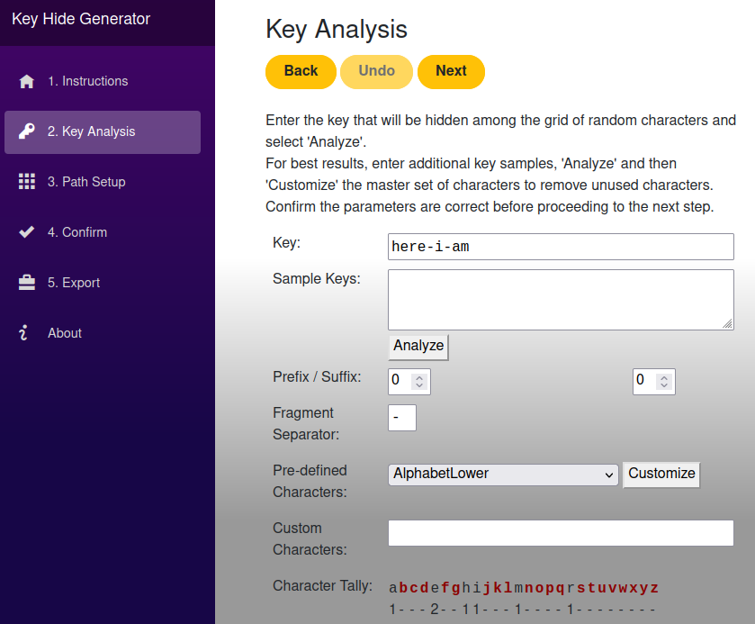
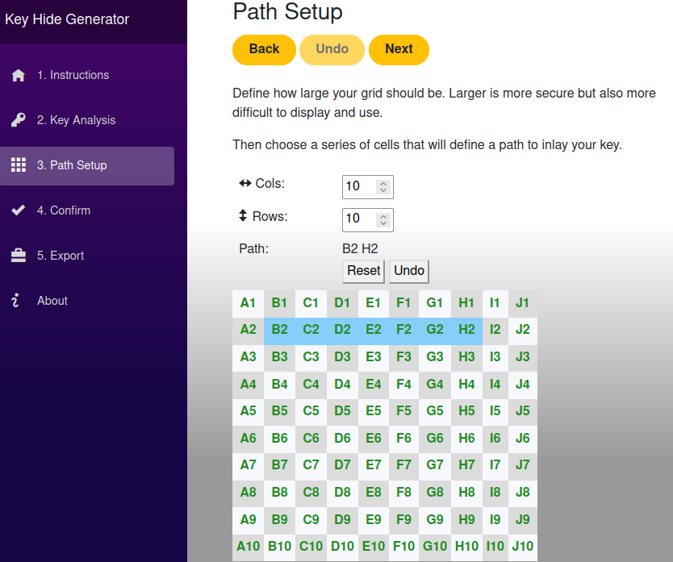

# Key Hide Generator
A tool for generating a key hide HTML file

**This application can be used online at: https://keyhidegen.freshcode.biz**

**DISCLAIMER: Use this software at your own risk. The author offers no warranty and makes no claims regarding the
effectiveness of the resulting key hide or the use of any key hide in protecting sensitive information.**

## Background
Sometimes you need to reproduce a series of random characters or 'key' but you don't want to write it down, and you can't remember it.
A 'key hide' contains the key but you need to know the coordinates to extract it.

This is similar to a physical [key lock box](https://www.google.com/search?q=key+lock+box&tbm=isch).

Try out a [simple example key hide](https://keyhidegen.freshcode.biz/example.html) (Click B2 then H2).
Or watch a [demonstration video](https://youtu.be/CL3XHqsjiiM) online.

## Screenshots
### Example Key Hide
Click to [open](https://keyhidegen.freshcode.biz/example.html) (And click B2 then H2).    

### Define the Key To Be Hidden

### Set Up The Secret Path

## Setup
1. [Install .NET 5.0](https://dotnet.microsoft.com/download)
1. Checkout the source: `clone --depth 1 https://github.com/p33t/keyhidegen.git`
1. `cd keyhidegen/ui`
1. Package up the application: `dotnet publish`
1. `cd bin/Debug/net5.0/publish/wwwroot`
1. Launch the static web server of your choice.  E.g. `python3 -m http.server 8080`
1. Open the [index.html](http://localhost:8080/) file in a browser (beware cached .js / .css files i.e. Be ready to Shift-refresh)

## Acknowledgements
[Blazor](https://dotnet.microsoft.com/apps/aspnet/web-apps/blazor) - Core technology  
[Open Iconic](https://useiconic.com/open) - Style, icons etc.  
[GitHub](https://github.com/) - For [project](https://github.com/p33t/keyhidegen) and [webpage](https://github.com/p33t/keyhidegen.freshcode.biz) hosting

## Release Process
- `dotnet publish -c Release`
- Copy `.../publish/wwwroot/*` to github pages project

TODO: Automate this